# 🦖 Dino-Game on STM32 🦖

This project implements a Dino-Game using the STM32F401RE development board, a 16x2 LCD display, and a joystick sensor. The game features a simple interface where a dinosaur dodges obstacles. This repository includes all the necessary code and documentation to recreate the project.

## Table of Contents

- [Hardware Requirements](#hardware-requirements-gear)
- [Software Requirements](#software-requirements-hash)

- [Hardware Setup](#hardware-setup-infinity)
- [Installing and Use](#3-install-and-use-)

- [Contributing](#contributing)
- [License](#license)

## Hardware Requirements :gear:

| Component             | Description                                   | Image |
|-----------------------|-----------------------------------------------|-------|
| **STM32F401RE**       | Nucleo board                                  | 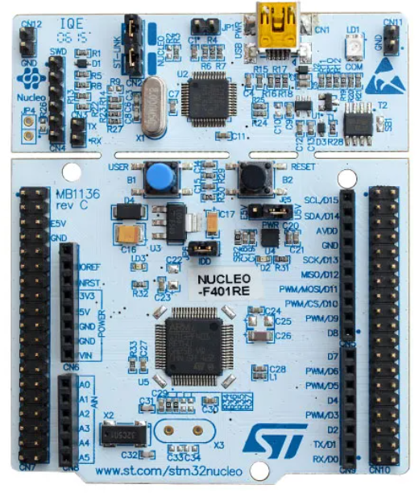 |
| **16x2 QAPASS LCD**   | LCD display                                   | 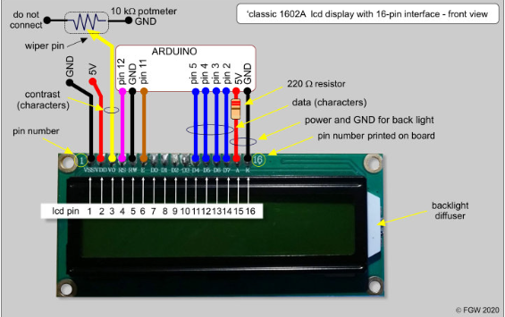 |
| **Joystick Sensor**   | Sensor for capturing joystick movements       | 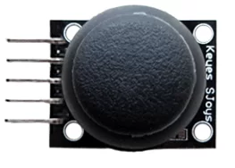 |
| **Breadboard**        | Breadboard for making connections             | 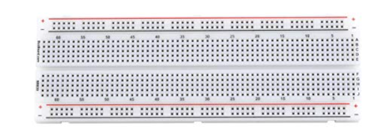 |
| **Jumper Wires**      | Wires for making connections                  | 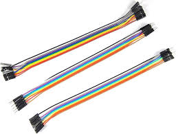 |
| **Potentiometer**     | For adjusting LCD contrast                    | 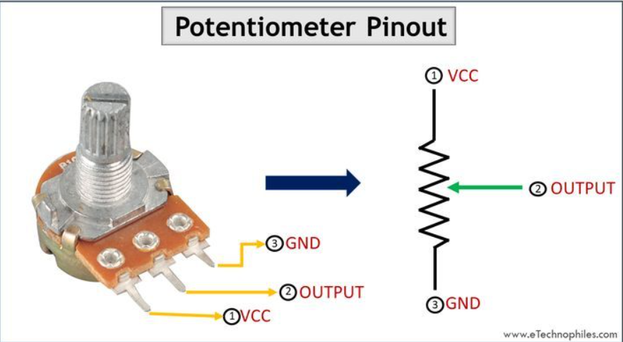 |

## Software Requirements :hash:

- STM32CubeMX (for initial configuration)
- STM32CubeIDE or Keil uVision (for coding and debugging)
- HAL (Hardware Abstraction Layer) libraries

## Hardware Setup :infinity:

Before to connect HW, take a look on the pin legends of the boards

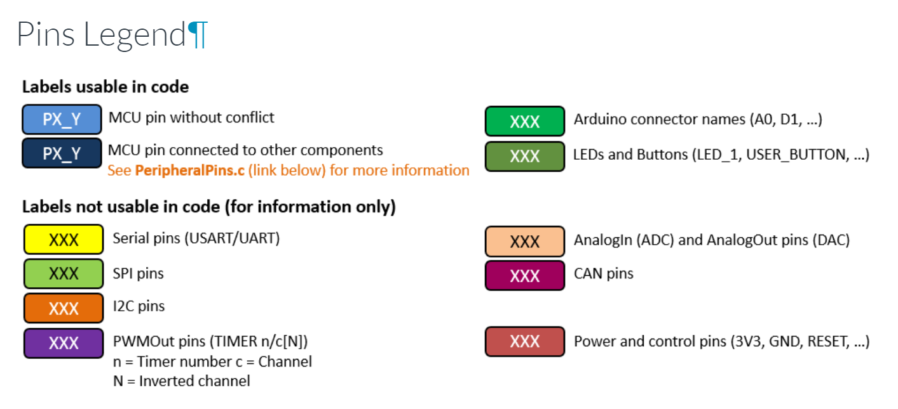

Take a look also at the pin analog and digital that we need to connect

<p align="center">
  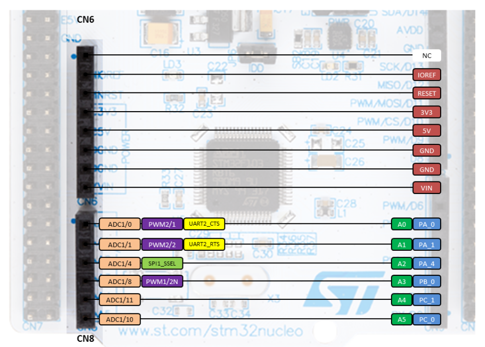
  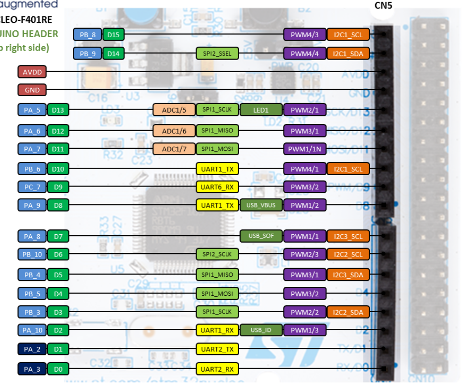
</p>

#### 1. Connecting LCD display to STM32 board

<p align="center">
  <table>
    <tr>
      <th>LCD Display Pin</th>
      <th>STM32 Board Pin > Pin CubeMX Config</th>
      <th>Connection Diagram</th>
    </tr>
    <tr>
      <td><strong>VSS</strong></td>
      <td>GND</td>
      <td rowspan="12" align="center">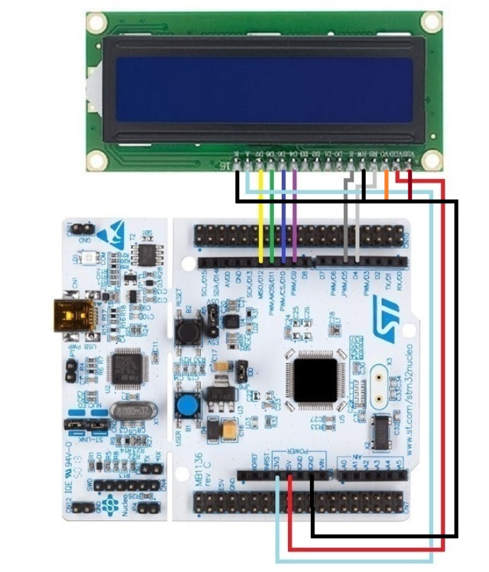</td>
    </tr>
    <tr>
      <td><strong>VDD</strong></td>
      <td>5V</td>
    </tr>
    <tr>
      <td><strong>V0</strong></td>
      <td>Potentiometer (for contrast control)</td>
    </tr>
    <tr>
      <td><strong>RS</strong></td>
      <td>D4  > PB_5</td>
    </tr>
    <tr>
      <td><strong>RW</strong></td>
      <td>GND</td>
    </tr>
    <tr>
      <td><strong>E</strong></td>
      <td>D5 > PB_4</td>
    </tr>
    <tr>
      <td><strong>D4</strong></td>
      <td>D9 > PC_7</td>
    </tr>
    <tr>
      <td><strong>D5</strong></td>
      <td>D10 > PB_6 </td>
    </tr>
    <tr>
      <td><strong>D6</strong></td>
      <td>D11 > PA_7</td>
    </tr>
    <tr>
      <td><strong>D7</strong></td>
      <td>D12 > PA_6</td>
    </tr>
    <tr>
      <td><strong>A</strong></td>
      <td>3.3V</td>
    </tr>
    <tr>
      <td><strong>K</strong></td>
      <td>GND</td>
    </tr>
  </table>
</p>

#### 2. Connecting Joystick Sensor to STM32 board

<p align="center">
  <table>
    <tr>
      <th>Joystick Pin</th>
      <th>STM32 Board Pin > Pin CubeMX Config</th>
      <th>Connection Diagram</th>
    </tr>
    <tr>
      <td><strong>VRx</strong></td>
      <td>A5 > PC_0</td>
      <td rowspan="4" align="center"></td>
    </tr>
    <tr>
      <td><strong>VRy</strong></td>
      <td>A4 > PC_1</td>
    </tr>
    <tr>
      <td><strong>SW</strong></td>
      <td>D2 > PA_10</td>
    </tr>
    <tr>
      <td><strong>GND</strong></td>
      <td>GND pin of Board</td>
    </tr>
  </table>
</p>


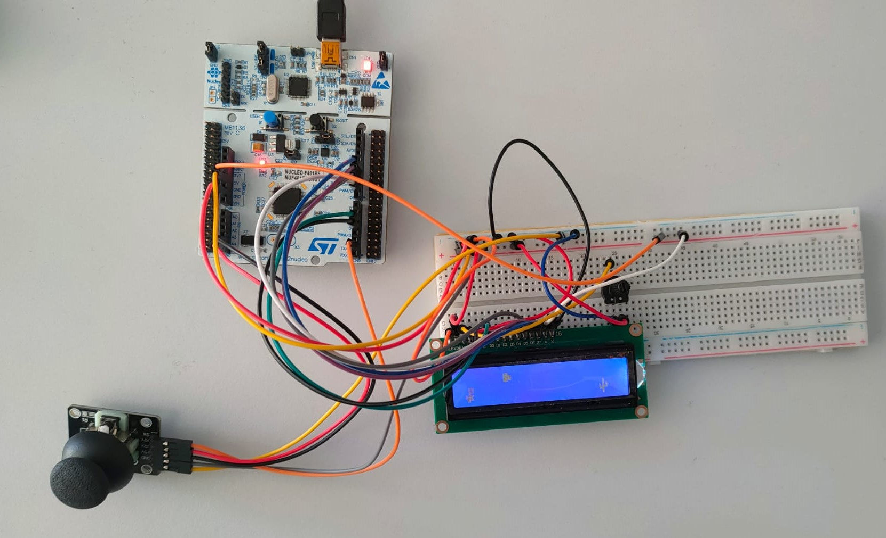


## 3. Install and Use 🎮

After you have connected all the wires and the sensor to the board, as shown in the schema, you can clone our repository and install the program on your board using **STM32CubeIDE**.

**NOTE :** If you want do the setup on your own , you can skip this and follow an example of settings that we show, click on [Do on your own!](./docs/do-on-your-own.md)

Repository: [Dino-Game](https://github.com/habeslab/Dino-Game.git)

### Using GitHub Desktop

1. Open GitHub Desktop.
2. Click on `File` > `Clone repository`.
3. Paste the repository URL: `https://github.com/habeslab/Dino-Game.git`.
4. Choose the local path where you want to clone the repository.
5. Click on `Clone`.

### Using Command Line on Windows

1. Open Command Prompt.
2. Navigate to the directory where you want to clone the repository.

   ```sh
   cd path\to\your\directory
   ```

3. Clone the repository:

   ```sh
   git clone https://github.com/habeslab/Dino-Game.git
   ```

### Using Command Line on Linux

1. Open Terminal.
2. Navigate to the directory where you want to clone the repository.

   ```sh
   cd path/to/your/directory
   ```

3. Clone the repository:

   ```sh
   git clone https://github.com/habeslab/Dino-Game.git
   ```

### Importing the Project into STM32CubeIDE

1. Open **STM32CubeIDE**.
2. Click on `File` > `Import`.
3. Select `General` > `Existing Projects into Workspace` and click `Next`.
4. Browse to the location where you cloned the repository and click `Finish`.
5. The project should now be imported into your workspace.

### Building and Flashing the Project

1. Connect your STM32F401RE board to your computer via USB.
2. In **STM32CubeIDE**, select the project in the Project Explorer.
3. Click on the `Build` button (hammer icon) to compile the project.
4. Once the build is successful, click on the `Run` button (green play icon) to flash the program onto your STM32F401RE board.

Now, your STM32F401RE board should be running the Dino-Game program. Enjoy!

<!--Insert mini video -->

## Contributing 🙋🏻

Contributions are welcome! Please feel free to contact us or open an issue to improve the game or add new features.

## License ©️

This project is licensed under the MIT License. See the [LICENSE](LICENSE) file for details.
