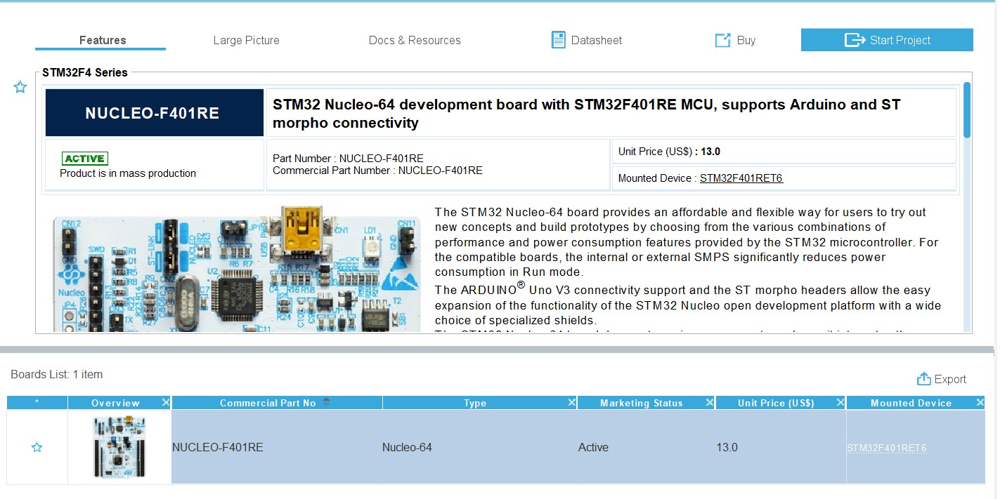

# Do on your Own! :zap:

Here there is a full example on how we have configured the pins, HAL and CMSIS of STM32Board

## STM32CubeMX Configuration

Follow these steps to configure the project using STM32CubeMX:

#### 1. Initial Configuration on CubeMX

1. **Open STM32CubeMX**:
   

2. **Start New Project**:
    From the initial Dashboard start a "New Project" and select **Access Board Selector**
    

3. **Select NUCLEO-F401RE**:
    In the field **Commercial Number** type the name of the board and after select that to start a project
    

    Now select the board that appear in the dashboard and after click on **Start Project** on the top right:
    

4. **Initialize Peripherals with Default Mode**:
    Press "Yes" on the window that appear and go on
    

#### 2. LCD Configuration on CubeMX

Follow the instructions on [LCD CubeMX Configuration](./lcd-setup-configuration.md) :open_book:

#### 3. Joystick Configuration on CubeMX

Follow the instructions on [Joystick CubeMX Configuration](./joystick-setup-configuration.md) :open_book:

#### 4. Generate Code

After following the instructions to setting up the STM32 Board we can generate the code and implements our game

- In **CubeMX** select the tab **Project Manager** and fill all the field missing
- Set the **"Project Name"**
- Set the **"Project Location"**
- In the field **"Toolchain/IDE"** Set the IDE that you want use, for our purpouse select **"STM32CubeIDE"**
 
- Click **Generate Code**

