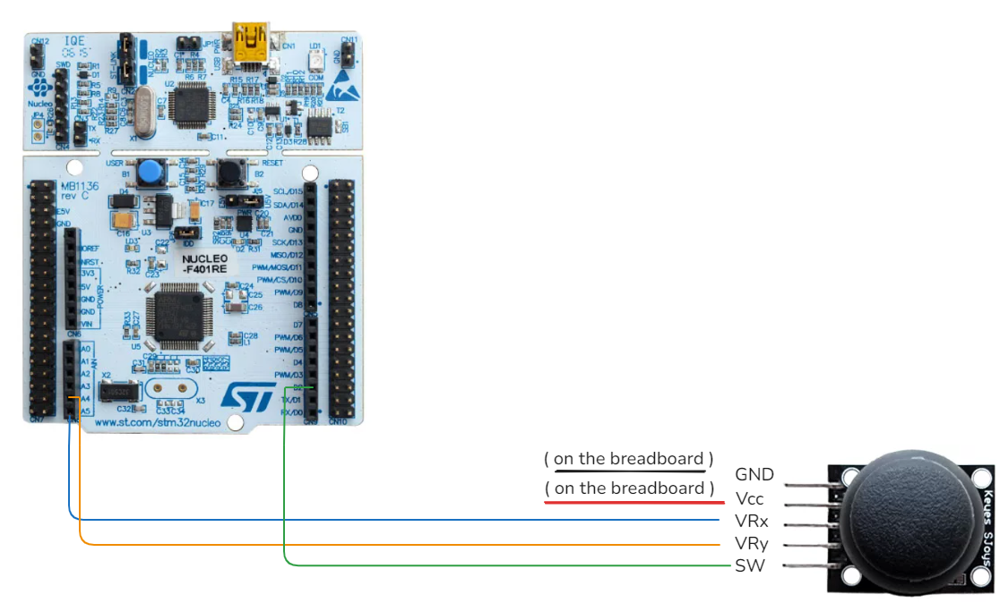
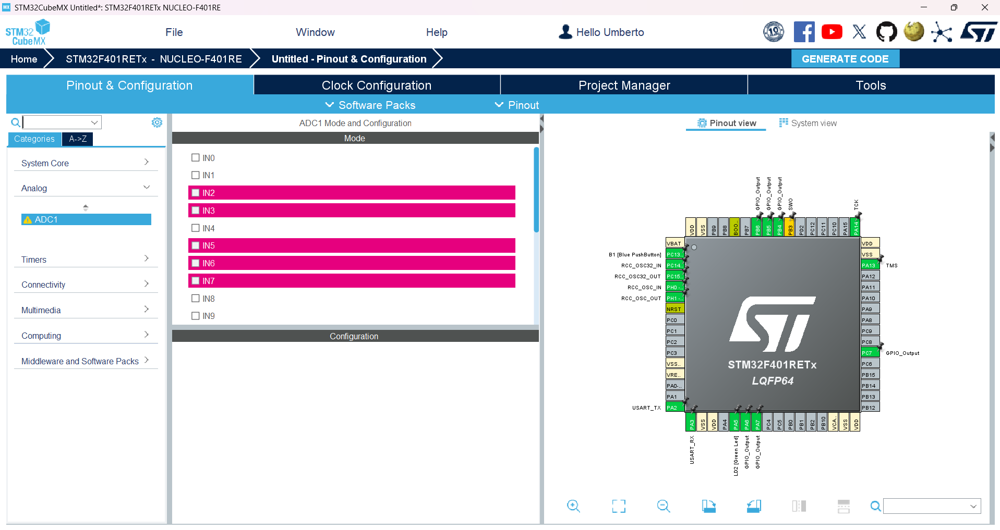
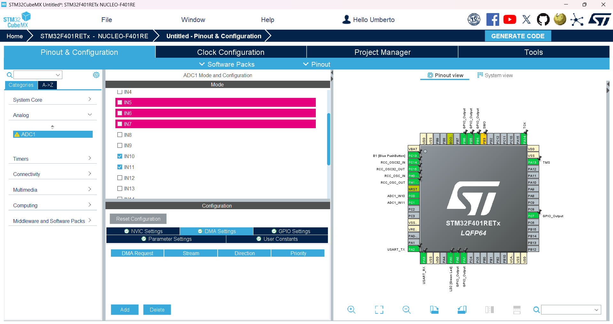
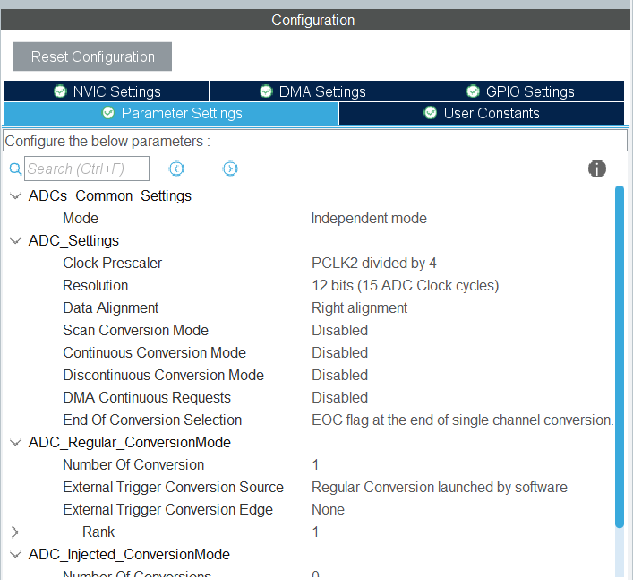
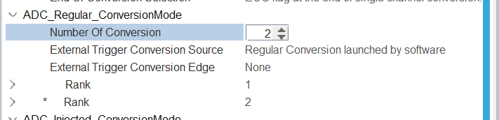
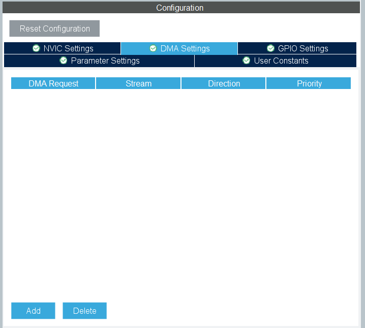
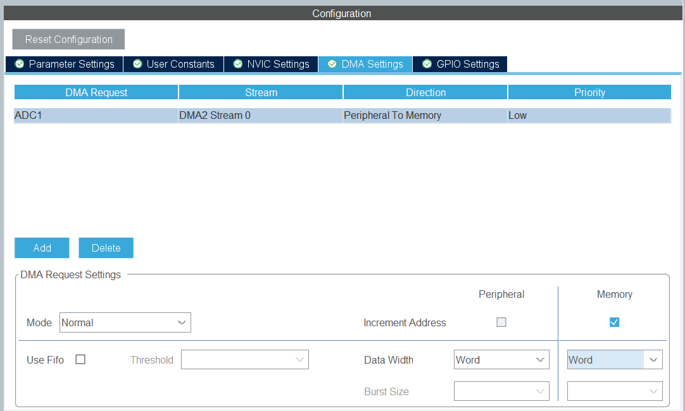
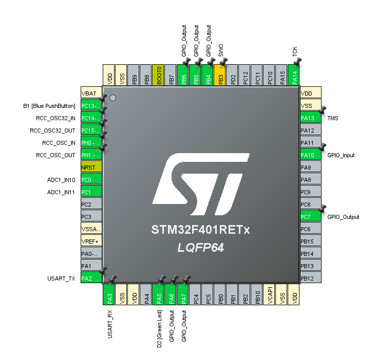
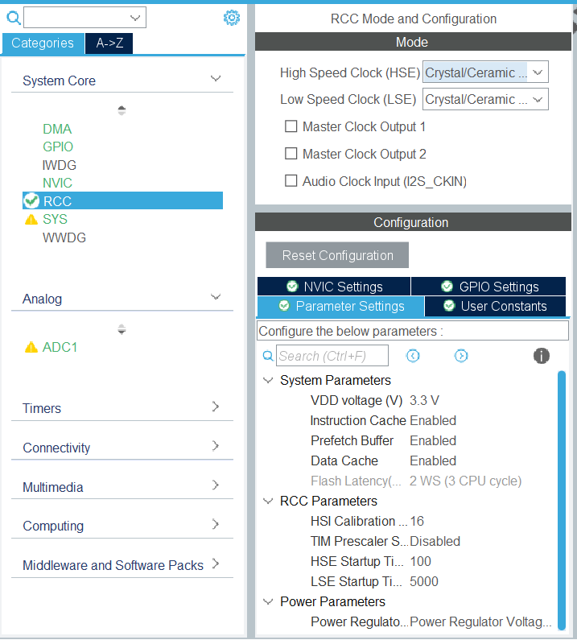
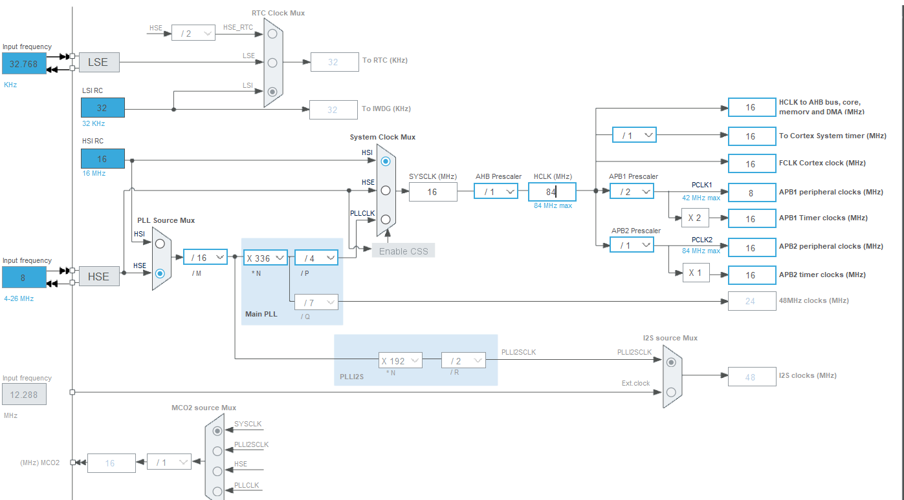

# Joystick Setup Configuration 🎮

Before to do the configuration on STM32CubeMX take a look of all pin configurations in this table

### 1. **Connecting Joystick Sensor to STM32 board**

  <table>
    <tr>
      <th>Joystick Pin</th>
      <th>STM32 Board Pin > Pin CubeMX Config</th>
      <th>Connection Diagram</th>
    </tr>
    <tr>
      <td><strong>VRx</strong></td>
      <td>A5 > PC_0</td>
      <td rowspan="4" align="center"></td>
    </tr>
    <tr>
      <td><strong>VRy</strong></td>
      <td>A4 > PC_1</td>
    </tr>
    <tr>
      <td><strong>SW</strong></td>
      <td>D2 > PA_10</td>
    </tr>
    <tr>
      <td><strong>GND</strong></td>
      <td>GND pin of Board</td>
    </tr>
  </table>

 

### 2. **Configure ADC1 with two channels**

- Navigate to the section **Analog**
   
    
- Click on  **ADC1** tab and select the analog pins that you have connected.
- Pay attention on select the right value, in this case we have **PC_0** , **PC_1** respectly situated in :
- **IN10** and  **IN11**. The next view that you have is like this.

     
    
- Now we need to set the **Channel Configuration** for retrieve the data from the two channels
- Go in the **Configuration** tab and click on **Parameters Setting**
   
    
- In the *ADC_Settings* :
- Click on **Scan Conversion Mode** and set **"Enabled"**
- Click on **Continuos Conversion Mode** and set **"Enabled"**
    
- In the *ADC_Regular_ConversionMode*:
- Click on **Number of conversion** and set **"2"**
   
    

- In the *Rank 1* :
- Set channel **10**
- Set cycles **480** ( the maximum cycle that board support )
   
    
- In the *Rank 2*:
- Set channel **11**
- Set the same cycles as we did before **480**
  
   

#### 2.1 Add ADC1 to DMA  

In this section we set the two ADC1 channels to DMA in this way:

- Goes in the **Configuration** settings as before and click on **DMA Settings**

- Click on **Add** and select **ADC1**
- After we select the *Mode* as **Normal** and the other parameter as **Word** as we see in the picture

### 2. GPIO Configuration

1. **Configure GPIO pin for joystick button**:
   - Navigate to the **GPIO Configuration** tab.
   - Set the pin **PA_10** as a GPIO input.
   - The final configuration look like that
     

### 3. Clock Configuration

1. **Ensure that the ADC clock is configured correctly in the RCC settings**:
   - Navigate to the **RCC Configuration** tab that is situated in **"System Core"**.
   - Set High Speed Clock HSE as **"Crystal/Ceramic Resonator"**
     

2. **Clock configuration Tab**
   - Take a look on the schema and we need to modify:
   - In **PLL Source MUX** select HSE
   - In **System Clock MUX** select HSI and the last value in the **HCLK(MHz)** select the maximum value that the board support
   

Now go [back](do-on-your-own.md/#4-generate-code)
