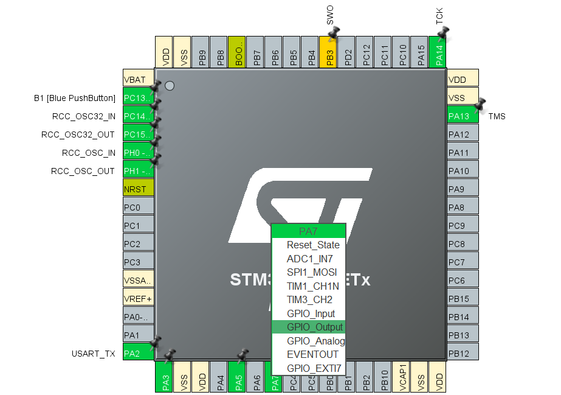
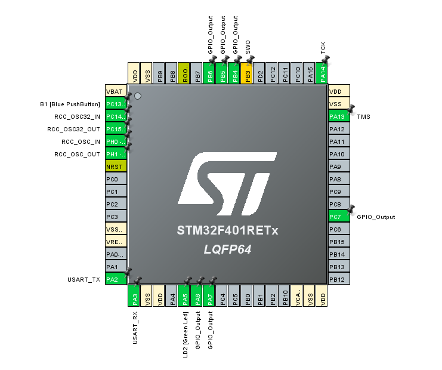

## LCD Display STM32CubeMX Configuration 💡

Before to do the configuration on STM32CubeMX take a look of all pin configurations in this table

  <table>
    <tr>
      <th>LCD Display Pin</th>
      <th>STM32 Board Pin > Pin CubeMX Config</th>
      <th>Connection Diagram</th>
    </tr>
    <tr>
      <td><strong>VSS</strong></td>
      <td>GND</td>
      <td rowspan="12" align="center"></td>
    </tr>
    <tr>
      <td><strong>VDD</strong></td>
      <td>5V</td>
    </tr>
    <tr>
      <td><strong>V0</strong></td>
      <td>Potentiometer (for contrast control)</td>
    </tr>
    <tr>
      <td><strong>RS</strong></td>
      <td>D4  > PB_5</td>
    </tr>
    <tr>
      <td><strong>RW</strong></td>
      <td>GND</td>
    </tr>
    <tr>
      <td><strong>E</strong></td>
      <td>D5 > PB_4</td>
    </tr>
    <tr>
      <td><strong>D4</strong></td>
      <td>D9 > PC_7</td>
    </tr>
    <tr>
      <td><strong>D5</strong></td>
      <td>D10 > PB_6 </td>
    </tr>
    <tr>
      <td><strong>D6</strong></td>
      <td>D11 > PA_7</td>
    </tr>
    <tr>
      <td><strong>D7</strong></td>
      <td>D12 > PA_6</td>
    </tr>
    <tr>
      <td><strong>A</strong></td>
      <td>3.3V</td>
    </tr>
    <tr>
      <td><strong>K</strong></td>
      <td>GND</td>
    </tr>
  </table>

### **GPIO Configuration**:
   - Iterate this process for all the pins that you need to configure. This is an example  configuration  of **PA_7** pin as **GPIO Output**
   
   - Configure the pins **PB_6**, **PC_7**, **PB_4**, **PB_5**, **PA_6** as GPIO Output.

### **Final Result of LCD Configuration Setup**

This is how we get from the initial Configuration of LCD display pin.

Now go to [Joystick configuration](joystick-setup-configuration.md) and follow the instructions.